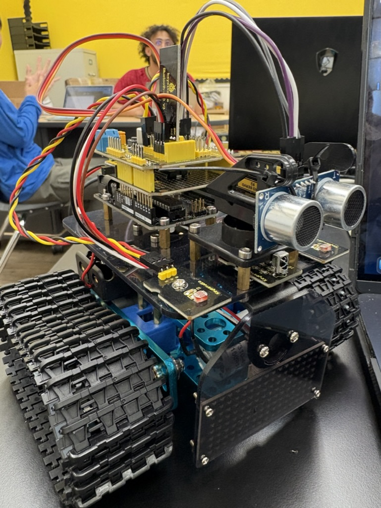

# Bluestamp Robot Project
Let's say you want to buy and play with a robot or a mini tank. However, you find out that either they are sold out or out of your price range and there is no way you can get one from any store or online ordering site. This project that is shown contains all the necessary components and parts that will make your day and let you have all the fun and adventure you want.


| **Engineer** | **School** | **Area of Interest** | **Grade** |
| Felix Z. | Army and Navy Academy| Mechanical engineering or Law | Incoming Senior |




# Third Milestone

<iframe width="560" height="315" src="https://www.youtube.com/embed/sAvNpXg4cZk?si=KJcDt0KYNVU-8vxa" title="YouTube video player" frameborder="0" allow="accelerometer; autoplay; clipboard-write; encrypted-media; gyroscope; picture-in-picture; web-share" referrerpolicy="strict-origin-when-cross-origin" allowfullscreen></iframe>

Introduction: This is my third milestone. I was able to control my robot successfully using the IR (Infared) remote and also updated my code in order to accomplish the connection between the Bluetooth module on the mini tank project to my IR remote.

Successes: The mini tank robot was able to move by the IR remote, which was able to connect with the bluetooth module that is on the project. This connection along with the newly updated code allowed my IR remote to move around the robot without just it following only the uploaded base code.

Challenges: A lot of my challenges that I faced were mostly connecting the IR remote to my project. The code for the IR remote that I put in had many complication errors like a line of code was not declared or the lines of code were not closed. Another challenge was trying out the controller. It was difficult to control it at first since there were many connection problems/errors and even when it had a good connection, when pressing the direction buttons it was still difficult to control where I want my project to go.

Future Goals: My last goal is to work on a modification on my mini tank project. The modification is that instead of using my IR Remote, I will instead use my phone as the controller instead. This way, I don't have to use my IR remote, which is a bit difficult to use, and can instead use my phone as an easier alternative controller.

Conclusion: My biggest challenges at BSE were mostly the coding part of BSE. It gave me the biggest challenge since I had to fix through many coding errors and even also building issues like loose screws, figuring out the placement of the wires, and building the bottom half of the mini tank robot. I learned many important topics at BSE but the most important ones I think I learned here is mechanical engineering (how to build stuff) and a introduction and depth into the world of coding. In the future after BSE, I hope I can learn more about the field of engineering, like how other parts work and learn more about how coding works for different things and dive more into the world of coding.


# Second Milestone

<iframe width="560" height="315" src="https://www.youtube.com/embed/qdJSDtxgtMA?si=9tu74roJGp_QFAGp" title="YouTube video player" frameborder="0" allow="accelerometer; autoplay; clipboard-write; encrypted-media; gyroscope; picture-in-picture; web-share" referrerpolicy="strict-origin-when-cross-origin" allowfullscreen></iframe>

Introduction: This is my second milestone. For my second milestone, I worked on my basic movement code for my mini tank project which was making the tracks move forwards, backwards, and also to turn around and move left and right

Successes: The code was able to successfully upload and run as expected. The mini tank robot was also able to read the programming and follow the coding instructions to move forwards and backwards

Challenges: Some challenges I faced were mostly Complication errors and uploading issues. For instance, some of the errors I recieved were mostly brackets that were missing from the code or an extra copy of a code that is not supposed to be there. Another error I faced was also not declaring a line of code that was not previously declared. I also did experience some uploading issues. For example, when uploading my finished code it was not able to upload and the issue was the microcontroller was heating up a little bit.

Future Goals: In the next week, I will work on putting other important lines of code into my Arduino IDE and my bluetooth module code so I could control my project with the IR sensor remote. This will also be my 3rd mileston and if time allows I will also work on modifications.

# First Milestone

<iframe width="560" height="315" src="https://www.youtube.com/embed/ZyAID4YIRaw?si=O3ZKyHvGhi6gX8Qo" title="YouTube video player" frameborder="0" allow="accelerometer; autoplay; clipboard-write; encrypted-media; gyroscope; picture-in-picture; web-share" referrerpolicy="strict-origin-when-cross-origin" allowfullscreen></iframe>

Introduction: This is my first milestone for my mini tank project, which is building each part of the project like the tracks, main body, wiring, and main board.
 
Successes: I was able to successfully finish building my project. I was able to screw together everything in place and was able to catch any building errors like loose screws and wrong placements of nuts and bolts.

Challenges: Some challenges I faced is building the bottom half of the robot which are the tracks. I struggled how to put some of the pieces together, like putting the tracks around the gear and screwing in the bolts to put together the two tracks because of the placement and size. Another challenge was the placement of the wires, which was confusing since there were a bunch of them here and there and it was difficult following which wire is correctly supposed to go to there.
 
Future Goals: In my future milestones, I am going to take on the coding for my main project and work on it until it can run properly and upload to my project, which will hopefully be able to work as intended.


# Starter Milestone

<iframe width="560" height="315" src="https://www.youtube.com/embed/8j-ba-zkg5s?si=kflLVxAjFd3qh76g" title="YouTube video player" frameborder="0" allow="accelerometer; autoplay; clipboard-write; encrypted-media; gyroscope; picture-in-picture; web-share" referrerpolicy="strict-origin-when-cross-origin" allowfullscreen></iframe>


Hi, my name is Felix Zhang. My starter project is the Mini Retro Arcade Game. How it works is you press the red button to turn it on. The blue buttons on the bottom left corner are the up, down, left, and right directions. The green and yellow buttons are there to help with other stuff like pausing and etc. When you turn it on, there are different versions of games similar to tetris that you can play. Some technical challenges I faced were soldering since it was my first time doing it. I was able to figure it out and finish it. 

<!--
# Schematics 
Here's where you'll put images of your schematics. [Tinkercad](https://www.tinkercad.com/blog/official-guide-to-tinkercad-circuits) and [Fritzing](https://fritzing.org/learning/) are both great resoruces to create professional schematic diagrams, though BSE recommends Tinkercad becuase it can be done easily and for free in the browser. 

# Code
Here's where you'll put your code. The syntax below places it into a block of code. Follow the guide [here]([url](https://www.markdownguide.org/extended-syntax/)) to learn how to customize it to your project needs. 

```c++
void setup() {
  // put your setup code here, to run once:
  Serial.begin(9600);
  Serial.println("Hello World!");
}

void loop() {
  // put your main code here, to run repeatedly:

}
-->

# Bill of Materials 

| **Part** | **Note** | **Price** | **Link** |
| Keyestudio V4.0 Development Board | the brain for my project and is used to read info from inputs and control outputs| $9.99 | <a href="[https://www.amazon.com/Arduino-A000066-ARDUINO-UNO-R3/dp/B008GRTSV6/](https://www.amazon.com/KEYESTUDIO-Development-Board-ATmega328P-Arduino/dp/B08H1RB61B)"> Link </a> |
| Tracks and gears | Used for my Mini Tank project to move around| N/A | <a href="N/A"> Link </a> |
| 2.0*40mm Screwdrivers | Used to screw the screws in| $10.30| <a href="(https://www.amazon.com/Wera-05117993001-Kraftform-Electronics-Screwdriver/dp/B003ES5LXG/ref=sr_1_10?dib=eyJ2IjoiMSJ9.M3kTZ0cjqcGZU56GhY8kLT5sXT3w370g8r0qox4-Hw0Rmxi8QkUowFnxsdjay8gObMsOWrB4pXtdPaQANWv90wNTufMOWeC1UgmZXWQzWmN85yb_PtKAM0VLyHH9-SMIH9B0zGucW1RVbssVKtMk998pNBD3HBOpMUFZN_8HoILHbYRM-vy2zta1MxMnA42LOParGTsoj_C5riU4MsvT6-Nd6ZyxYz2EguESBc1lpZzHOrynZwqIK33sQB7oB7Q_UxFHXPBywFqH8Zdj9SgYwdlW2p3FZRG58Px3y3LcYUs.j8-ef83Ri20e5YS-xNq6PiLjlepOOZvt7kDO_MNJrL8&dib_tag=se&keywords=Screwdriver%2Bprecision%2Bslotted%2B2%2B0x40mm%2BNEO&qid=1783011154&sr=8-10&th=1)"> Link </a> |
| Accessories Box | Has some of the important stuff for my project| NA | <a href="N/A"> Link </a> |
| Sensor Shield V5| Used for my project to plug in the sensors| NA | <a href="(https://www.newegg.com/p/1W7-00V1-00K00?item=9SIC12YKPJ0151&utm_source=google&utm_medium=organic+shopping&utm_campaign=knc-googleadwords-_-cables%20-%20internal%20power%20cables-_-aomoproing-_-9SIC12YKPJ0151&source=region&negg_topt=0&srsltid=AfmBOooFZkmp2wMC6Xg-YXBzT0AWsrvbHt7-IBNcqOsxfYOOU4ADeg6ISDM)"> Link </a> |
| Battery Holder | used to hold the batteries to power my project| NA | <a href="N/A"> Link </a> |
| motor shield | used for my project to handle speed, direction, and power and helps microcontroller| $28.40 | <a href="(https://store-usa.arduino.cc/products/arduino-motor-shield-rev3)"> Link </a> |
| HC-SRO4 sensor | used for my project to detect obstacles when one is too close| $5.25 | <a href="(https://store-usa.arduino.cc/products/arduino-motor-shield-rev3)"> Link </a> |
| Keyestudio Photoresistors | used for my project as a sensor when detecting the intensity of the light| $3.80 | <a href="(https://www.keyestudio.com/products/free-shipping-keyestudio-photoresistor-light-dependent-resistor-sensor-module-for-arduino)])"> Link </a> |
| Keyestudio Photoresistors | used for my project to detect nearby obstacles, movement, etc| $4.00 | <a href="(https://www.keyestudio.com/products/keyestudio-ir-infrared-obstacle-avoidance-sensor-module-for-arduino-robot-car)"> Link </a> |


# Other Resources/Examples
One of the best parts about Github is that you can view how other people set up their own work. Here are some past BSE portfolios that are awesome examples. You can view how they set up their portfolio, and you can view their index.md files to understand how they implemented different portfolio components.
- [Example 1](https://trashytuber.github.io/YimingJiaBlueStamp/)
- [Example 2](https://sviatil0.github.io/Sviatoslav_BSE/)
- [Example 3](https://arneshkumar.github.io/arneshbluestamp/)

To watch the BSE tutorial on how to create a portfolio, click here.
