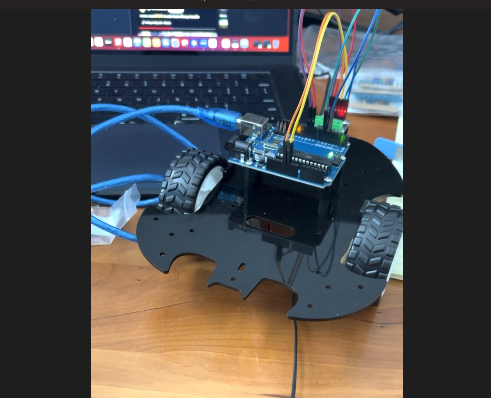

# Bluestamp Robot Project
Let's say you want to buy and play with a robot or a mini tank. However, you find out that either they are sold out or out of your price range and there is no way you can get one from any store or online ordering site. This project that is shown contains all the necessary components and parts that will make your day and let you have all the fun and adventure you want.

```HTML 
<!--- This is an HTML comment in Markdown -->
<!--- Anything between these symbols will not render on the published site -->
```

| **Engineer** | **School** | **Area of Interest** | **Grade** |
| Felix Z. | Army and Navy Academy| Electrical/Mechanical engineering | Incoming Senior |



<!--
For your final milestone, explain the outcome of your project. Key details to include are:
- What you've accomplished since your previous milestone
- What your biggest challenges and triumphs were at BSE
- A summary of key topics you learned about
- What you hope to learn in the future after everything you've learned at BSE
--!>

<!--
# Second Milestone

**Don't forget to replace the text below with the embedding for your milestone video. Go to Youtube, click Share -> Embed, and copy and paste the code to replace what's below.**

<iframe width="560" height="315" src="https://www.youtube.com/embed/y3VAmNlER5Y" title="YouTube video player" frameborder="0" allow="accelerometer; autoplay; clipboard-write; encrypted-media; gyroscope; picture-in-picture; web-share" allowfullscreen></iframe>

For your second milestone, explain what you've worked on since your previous milestone. You can highlight:
- Technical details of what you've accomplished and how they contribute to the final goal
- What has been surprising about the project so far
- Previous challenges you faced that you overcame
- What needs to be completed before your final milestone 
-->
# First Milestone

<iframe width="560" height="315" src="https://www.youtube.com/embed/ZyAID4YIRaw?si=O3ZKyHvGhi6gX8Qo" title="YouTube video player" frameborder="0" allow="accelerometer; autoplay; clipboard-write; encrypted-media; gyroscope; picture-in-picture; web-share" referrerpolicy="strict-origin-when-cross-origin" allowfullscreen></iframe>

 This is my first milestone for my mini tank project. I was able to successfully finish building my project and figured out how to build each part of the mini tank. The wires are connected to the main board to the motors, battery, and sensors so when I put the code in they will deliver that command. The tracks are the robots main method of movement and the sensor is able to detect any obstacle. Some challenges I faced is building the bottom half of the robot which are the tracks. I struggled how to put some of the pieces together but was able to figure it out. Another challenge was the eyes, which I took a bit to figure it out and also the placement of the wiring, which was also hard because you have to know which wire goes to where. In my next milestone, I am going to take on the coding for my main project and work on it until it can run properly.


# Starter Milestone

<iframe width="560" height="315" src="https://www.youtube.com/embed/8j-ba-zkg5s?si=kflLVxAjFd3qh76g" title="YouTube video player" frameborder="0" allow="accelerometer; autoplay; clipboard-write; encrypted-media; gyroscope; picture-in-picture; web-share" referrerpolicy="strict-origin-when-cross-origin" allowfullscreen></iframe>


Hi, my name is Felix Zhang. My starter project is the Mini Retro Arcade Game. How it works is you press the red button to turn it on. The blue buttons on the bottom left corner are the up, down, left, and right directions. The green and yellow buttons are there to help with other stuff like pausing and etc. When you turn it on, there are different versions of games similar to tetris that you can play. Some technical challenges I faced were soldering since it was my first time doing it. I was able to figure it out and finish it. 

# Schematics 
Here's where you'll put images of your schematics. [Tinkercad](https://www.tinkercad.com/blog/official-guide-to-tinkercad-circuits) and [Fritzing](https://fritzing.org/learning/) are both great resoruces to create professional schematic diagrams, though BSE recommends Tinkercad becuase it can be done easily and for free in the browser. 

# Code
Here's where you'll put your code. The syntax below places it into a block of code. Follow the guide [here]([url](https://www.markdownguide.org/extended-syntax/)) to learn how to customize it to your project needs. 

```c++
void setup() {
  // put your setup code here, to run once:
  Serial.begin(9600);
  Serial.println("Hello World!");
}

void loop() {
  // put your main code here, to run repeatedly:

}
```

# Bill of Materials 

| **Part** | **Note** | **Price** | **Link** |
| Keyestudio V4.0 Development Board | the brain for my project and is used to read info from inputs and control outputs| $9.99 | <a href="[https://www.amazon.com/Arduino-A000066-ARDUINO-UNO-R3/dp/B008GRTSV6/](https://www.amazon.com/KEYESTUDIO-Development-Board-ATmega328P-Arduino/dp/B08H1RB61B)"> Link </a> |
| Tracks and gears | Used for my Mini Tank project to move around| N/A | <a href="N/A"> Link </a> |
| 2.0*40mm Screwdrivers | Used to screw the screws in| $10.30| <a href="(https://www.amazon.com/Wera-05117993001-Kraftform-Electronics-Screwdriver/dp/B003ES5LXG/ref=sr_1_10?dib=eyJ2IjoiMSJ9.M3kTZ0cjqcGZU56GhY8kLT5sXT3w370g8r0qox4-Hw0Rmxi8QkUowFnxsdjay8gObMsOWrB4pXtdPaQANWv90wNTufMOWeC1UgmZXWQzWmN85yb_PtKAM0VLyHH9-SMIH9B0zGucW1RVbssVKtMk998pNBD3HBOpMUFZN_8HoILHbYRM-vy2zta1MxMnA42LOParGTsoj_C5riU4MsvT6-Nd6ZyxYz2EguESBc1lpZzHOrynZwqIK33sQB7oB7Q_UxFHXPBywFqH8Zdj9SgYwdlW2p3FZRG58Px3y3LcYUs.j8-ef83Ri20e5YS-xNq6PiLjlepOOZvt7kDO_MNJrL8&dib_tag=se&keywords=Screwdriver%2Bprecision%2Bslotted%2B2%2B0x40mm%2BNEO&qid=1783011154&sr=8-10&th=1)"> Link </a> |
| Accessories Box | Has some of the important stuff for my project| NA | <a href="N/A"> Link </a> |
| Sensor Shield V5| Used for my project to plug in the sensors| NA | <a href="(https://www.newegg.com/p/1W7-00V1-00K00?item=9SIC12YKPJ0151&utm_source=google&utm_medium=organic+shopping&utm_campaign=knc-googleadwords-_-cables%20-%20internal%20power%20cables-_-aomoproing-_-9SIC12YKPJ0151&source=region&negg_topt=0&srsltid=AfmBOooFZkmp2wMC6Xg-YXBzT0AWsrvbHt7-IBNcqOsxfYOOU4ADeg6ISDM)"> Link </a> |
| Battery Holder | used to hold the batteries to power my project| NA | <a href="N/A"> Link </a> |
| motor shield | used for my project to handle speed, direction, and power and helps microcontroller| $28.40 | <a href="(https://store-usa.arduino.cc/products/arduino-motor-shield-rev3)"> Link </a> |
| HC-SRO4 sensor | used for my project to detect obstacles when one is too close| $5.25 | <a href="(https://store-usa.arduino.cc/products/arduino-motor-shield-rev3)"> Link </a> |
| Keyestudio Photoresistors | used for my project as a sensor when detecting the intensity of the light| $3.80 | <a href="(https://www.keyestudio.com/products/free-shipping-keyestudio-photoresistor-light-dependent-resistor-sensor-module-for-arduino)])"> Link </a> |
| Keyestudio Photoresistors | used for my project to detect nearby obstacles, movement, etc| $4.00 | <a href="(https://www.keyestudio.com/products/keyestudio-ir-infrared-obstacle-avoidance-sensor-module-for-arduino-robot-car)"> Link </a> |


# Other Resources/Examples
One of the best parts about Github is that you can view how other people set up their own work. Here are some past BSE portfolios that are awesome examples. You can view how they set up their portfolio, and you can view their index.md files to understand how they implemented different portfolio components.
- [Example 1](https://trashytuber.github.io/YimingJiaBlueStamp/)
- [Example 2](https://sviatil0.github.io/Sviatoslav_BSE/)
- [Example 3](https://arneshkumar.github.io/arneshbluestamp/)

To watch the BSE tutorial on how to create a portfolio, click here.
